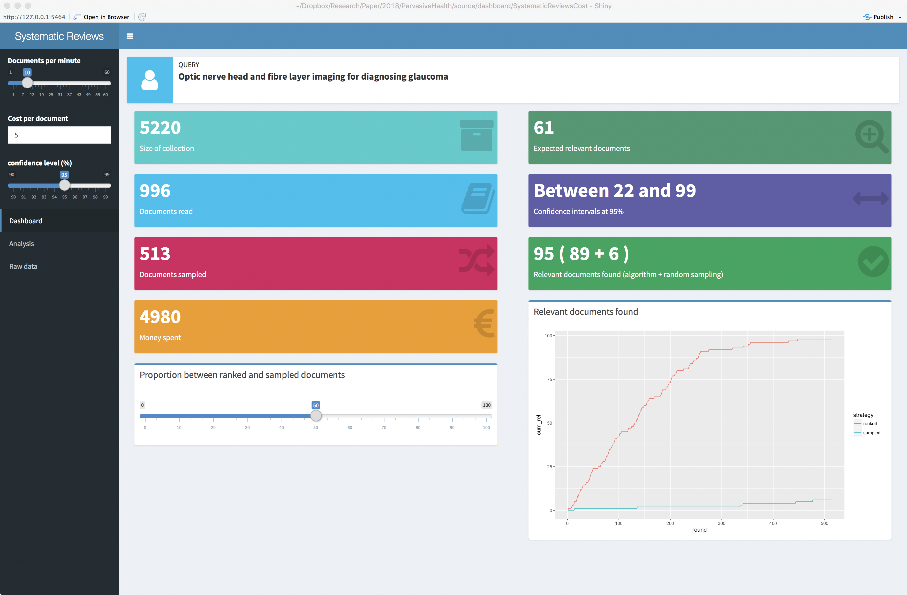
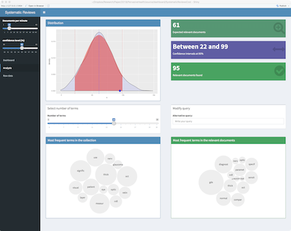

```{r setup, include=FALSE}
knitr::opts_chunk$set(echo = TRUE)
```

# Technologically Assisted Medical Systematic Reviews

In this demo, we present an extension to a variable threshold approach to tackle the problem of a systematic review task based on the active learning framework proposed by [@DBLP:conf/clef/NunzioBVH17a; @DiNunzio2018]. This approach defines a stopping strategy based on the geometry of the two-dimensional space of documents [@DiNunzio2014; @DiNunzio201713] that uses the explicit relevance feedback information given by the expert to automatically estimate the number of documents (medical publications or clinical trials) that need to be read. This approach has demonstrated to outperform all the other systems by reaching a recall recall greater than 95% with 25,000 documents less than the best performing systems. 

# Demo


The demo has been implemented using the Shiny Dashboard R package (<https://rstudio.github.io/shinydashboard/>). The application has two main parts: a sidebar for the main interaction with the system and the body for monitoring the results in real time.

## Main Dashboard

The main dashboard shows the pieces of information we need in order to estimate the costs of the systematic review and the amount of relevant information found which is updated every time a clinician reviews a document.



## Analysis Panel

The second panel  shows a detailed analysis on the probability distribution of the relevant documents in the collection as well as two word clouds that show the most frequent terms found in the whole collection and in the relevant documents



# References
